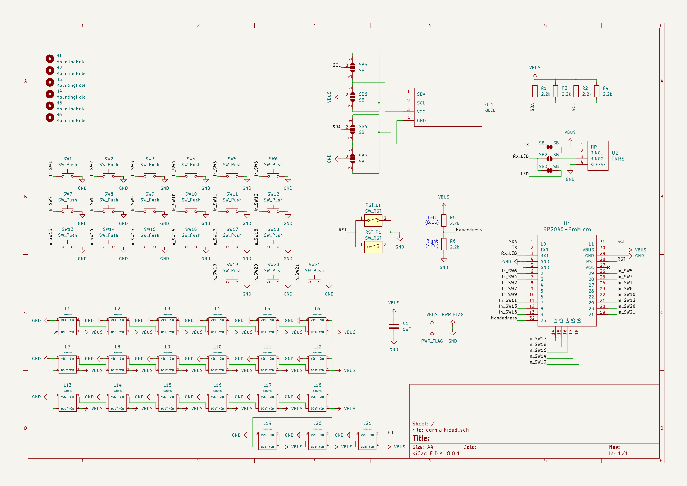
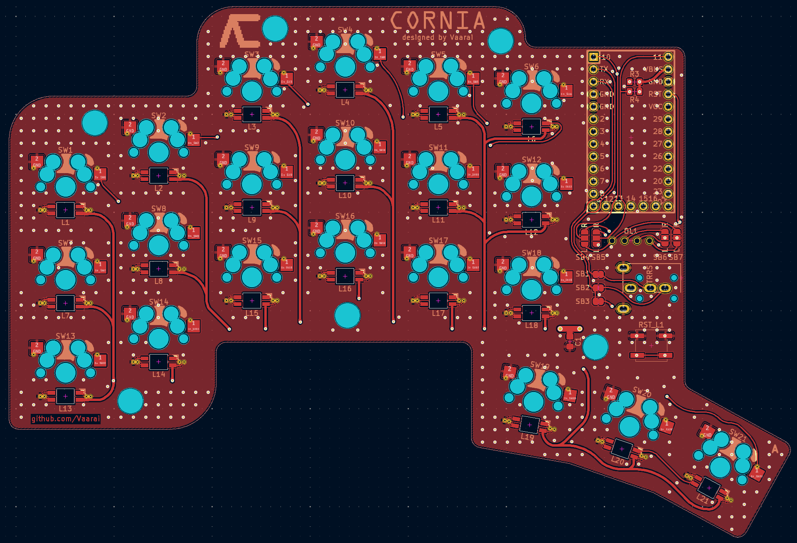
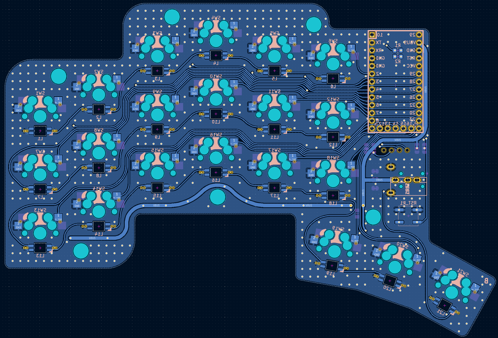

# Cornia keyboard

The Cornia keyboard is a split keyboard featuring : 
- 3x6 column strongly staggered keys and 3 thumb keys
- All 1u keys, tested with [DES profile](https://github.com/pseudoku/PseudoMakeMeKeyCapProfiles)
- Optional Backlight adressable RGB led

## Hardware

- [Compatible controllers](./doc/controller.md)
- [Kicad PCB Gerber & laser cutted case](./doc/pcb.md)

### Bill of material

| Name | Count | Remarks |
|:-|:-|:-|
| PCB | 2 | |
| OLED cover | 2 sheets | |
| [RP2040 ProMicro](https://keeb.io/products/rp2040-pro-micro-usb-c-controller) | 2 | Alternative: [Elite-C](https://deskthority.net/wiki/Elite-C) or Aliexpress RP2040 ProMicro |
| TRRS 3.5mm jack | 2 | |
| Reset switch | 2 |  |
| Hotswap sockets | 42 | Compatible with Kailh and Gateron |
| Key switches | 42 | Only compatible with MX style |
| Keycaps | 42 pieces | 1u 42 pcs |
| TRRS (4 poles) cable | 1 | |
| USB cable | 1 | USB Micro or USB-C depending on the controller, avoid charge-only cables |

## Software

No software available for now but it will be based on QMK.

## Photos

