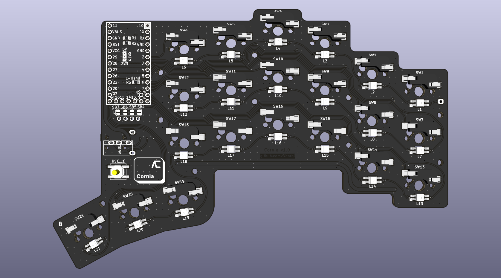

<h1 align="center">
 
</h1>

# Cornia keyboard

The Cornia keyboard is a split keyboard featuring : 
* 3x6 column strongly staggered keys and 3 thumb keys
* Hotswap sockets (Compatible with Kailh and Gateron)
* All 1u keys
* Same PCB for both hands (revesible)
* No diode to solder (No switch matrix)
* Per key adressable RGB leds (SK6812MINI-E)
* QMK Handedness pin (see [QMK documentation](https://github.com/qmk/qmk_firmware/blob/master/docs/config_options.md#setting-handedness))

### Why this name ?

Because it was inspired from the [Corne](https://github.com/foostan/crkbd/tree/main) keyboard, and `Cornia` came in mind.

### Table of contents

<!--ts-->
  * [Hardware](#hardware)
    * [Bill of material](#bill-of-material)
    * [Compatible controllers](#compatible-controllers)
    * [PCB Design](#pcb-design-and-manufacturing)
    * [Troubleshooting](#troubleshooting)
  * [Software](#software)
  * [Photos](#photos)
  * [ToDo](#todo)
<!--te-->

# Hardware

### Bill of material

| Name | Count | Remarks |
|:-|:-|:-|
| PCB | 2 | |
| OLED cover | 2 sheets | |
| [RP2040 ProMicro](https://keeb.io/products/rp2040-pro-micro-usb-c-controller) | 2 | Alternative: Refer to [Compatible controllers](#compatible-controllers) |
| TRRS 3.5mm jack | 2 | |
| Reset switch | 2 | SMD 4x4mm |
| I²C Pull-up resistors | 2 | 0805 form-factor and any value between 2.2kΩ and 4.7kΩ |
| Handedness Pull-up/down resistor | 1 | 0805 form-factor and any value between 2.2kΩ and 4.7kΩ |
| Hotswap sockets | 42 | Compatible with Kailh and Gateron |
| Key switches | 42 | Only compatible with MX style |
| Keycaps | 42 | 1u size |
| TRRS (4 poles) cable | 1 | |
| USB cable | 1 | USB Micro or USB-C depending on the controller, avoid charge-only cables |

### Compatible controllers

| Reference | I²C OLED Screen | Handedness pin | Other features |
|:-|:-:|:-:|:-:|
| [RP2040 Aliexpress](https://fr.aliexpress.com/item/1005005980167753.html) | $${\color{green}✓}$$ | $${\color{green}✓}$$ | $${\color{green}✓}$$ |
| [RP2040 keeb.io](https://keeb.io/products/rp2040-pro-micro-usb-c-controller) | $${\color{green}✓}$$ | $${\color{green}✓}$$ | $${\color{green}✓}$$ |
| [0xCB-Helios](https://github.com/0xCB-dev/0xCB-Helios) | $${\color{green}✓}$$ | $${\color{green}✓}$$ | $${\color{green}✓}$$ |
| [Elite-Pi](https://docs.keeb.io/elite-pi-guide) | $${\color{red}⨯}$$ | $${\color{red}⨯}$$ | $${\color{green}✓}$$ |
| [RP Micro](https://github.com/siderakb/rp-micro) | $${\color{red}⨯}$$ | $${\color{red}⨯}$$ | $${\color{green}✓}$$ |

### PCB design and manufacturing

Schematic and PCB views are available in `pdf/`:
- [Schematic](pdf/SCH.pdf)
- [PCB Top view](pdf/PCB_TOP.pdf)
- [PCB Bottom view](pdf/PCB_BOT.pdf)

To manufacture the Cornia PCB please follow the [PCB manufacturing guide](./doc/pcb_ordering.md)

In case you modified the PCB you can use the export bash script to ease the process, it is documented in [Manufacturing files export guide](./doc/manufacturing_files_export.md)

### Troubleshooting

[Troubleshooting guide](./doc/troubleshooting_pcb.md)

# Software

Software will be available soon (based on QMK).

# Photos

 
# TODO
  * [Image converter](https://github.com/MakotoKurauchi/helix/tree/master/FontConverter)
  * [QMK](https://github.com/qmk/qmk_firmware/blob/master/docs/platformdev_rp2040.md)
  * [Troubleshooting guide](https://github.com/jpconstantineau/ErgoTravel/blob/master/Troubleshooting_steps.md)
  * [Inspirations](https://github.com/diimdeep/awesome-split-keyboards?tab=readme-ov-file)