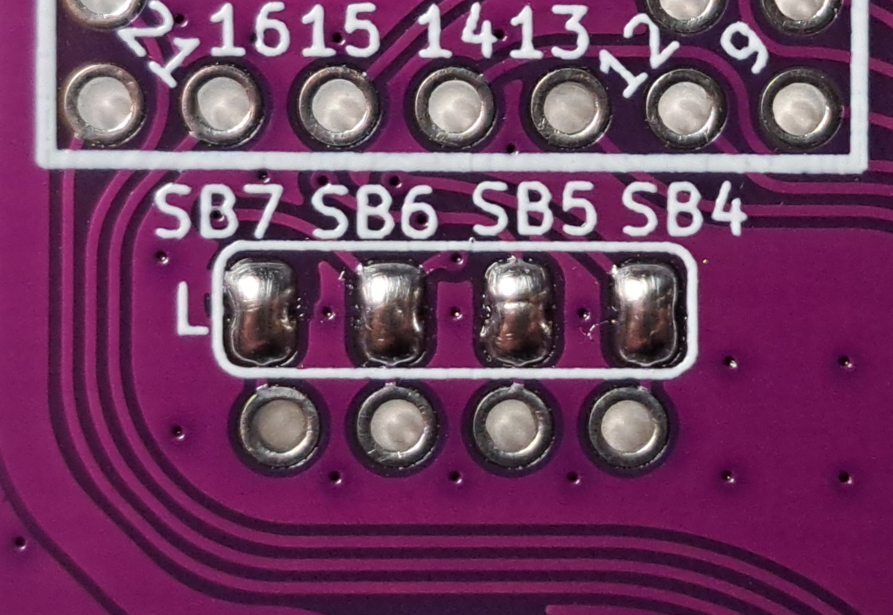
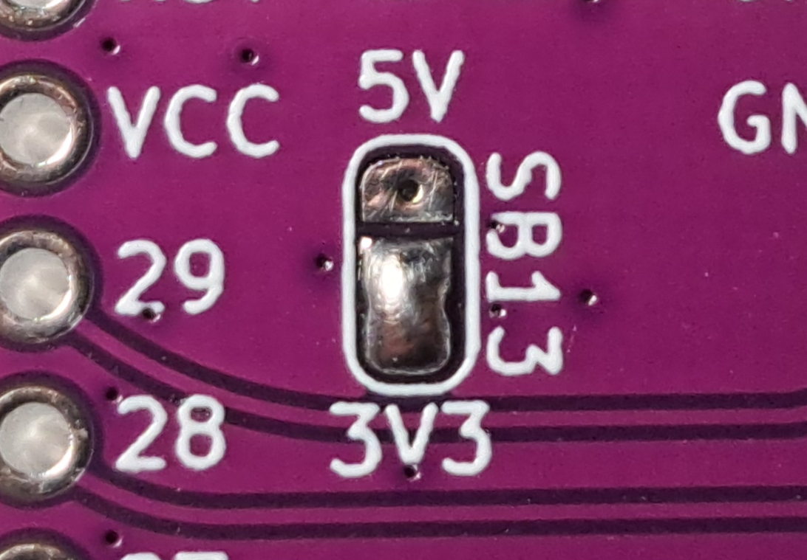
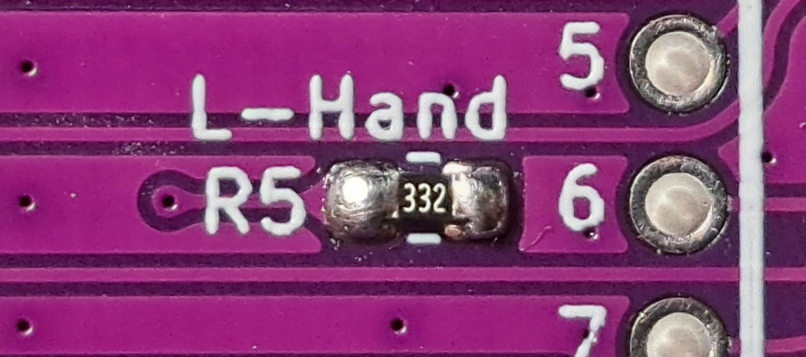
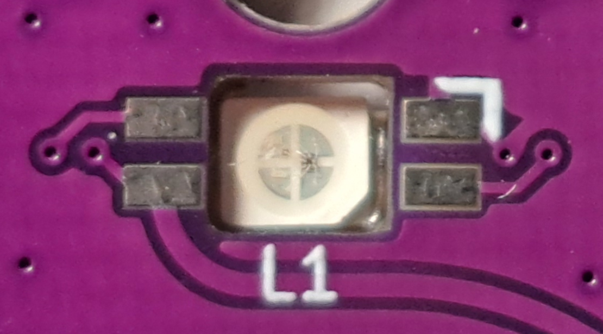
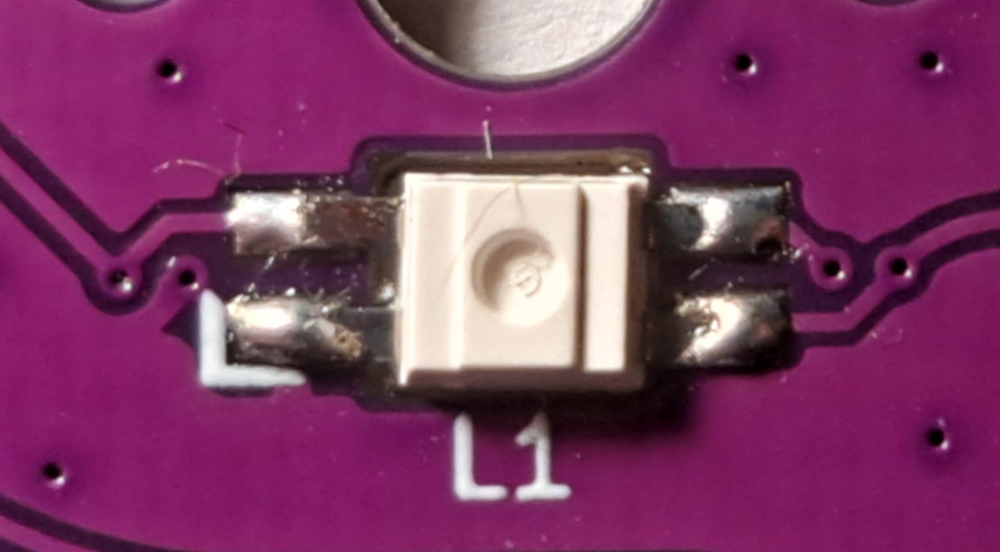
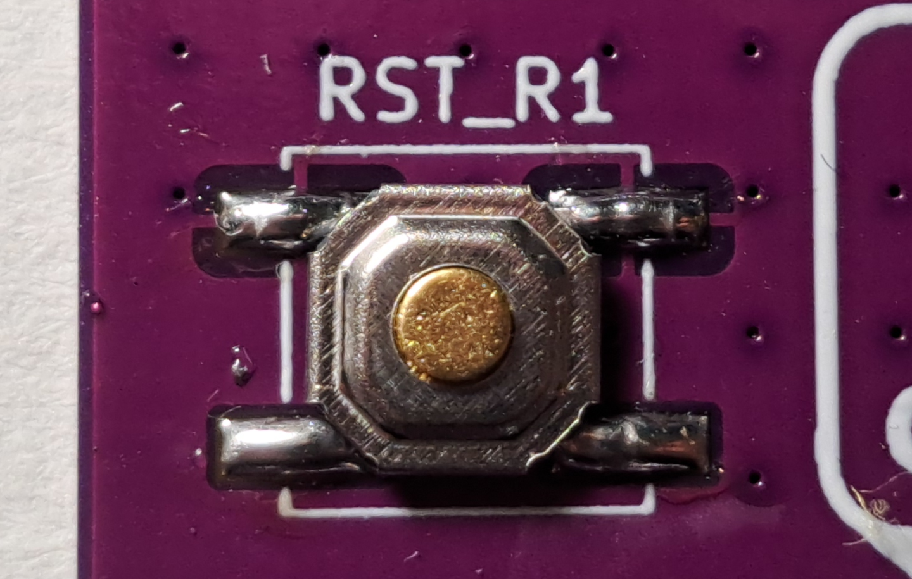

# Preparation

This guide will help you to assemble your Cornia keyboard following steps below.

## Tools

List of tools required to solder & assemble the Cornia:
- Soldering iron with a relatively thin tip
- Solder wire and flux
- Tweezer to handle small components during the soldering

And below is the tools required to test the soldering: 
- Multimeter or at least continuity tester

Useful documents for the components placement and soldering:
- [PCB schematic](./../pdf/SCH.pdf)
- [Toubleshooting guide](./troubleshooting_pcb.md)

## Parts list

Ensure you get all parts in hand from [Bill of material](./../README.md#bill-of-material)

## PCB Marking

Some marking are present on the PCB to help component placement.
- Faces are noted at the extremity of the thumb cluster (Face `A` or `B`):
    - On the left hand PCB, face noted `A` shall be the top face.
    - On the right hand PCB, face noted `B` shall be the top face.
- All components are labeled to identify them both on schematic and PCB :
    - `SWx` : Keyboard switches including hotswap socket
    - `Lx` : Per key RGB led
    - `SBx` : Solder bridges used to cunfigure the board
    - `Rx` : Resistors
    - `RSTx` : Reset button (solder `RST_Lx` for left and `RST_Rx` for right hand)
    - `TRRS` : TRRS connector
    - `OLx` : OLED Display
    - `Cx` : Capacitor
    - `Jx` : Test point
- Additionnal labels are present to help with the configuration:
    - `SB4` to `SB11` are grouped and labeled `L` or `R` to distinguish left hand and right hand configuration
    - `SB12` and `SB13` are labeled with the voltage to configure on the I²C bus (`5V` or `3V3`)
    - `R5` and `R6` are labeled `L-Hand` and `R-Hand` to configure the [QMK handedness](https://docs.qmk.fm/features/split_keyboard#handedness-by-pin)

# Soldering

## Quick steps by steps

### Left hand PCB
[***STEP 1***](#solder-bridges) - Solder `SB4` to `SB7` 
[***STEP 2***](#solder-bridges) - Solder `SB13` according to desired OLED display voltage 
[***STEP 3***](#resistors) - Solder `R5` with 0805 resistor from 2.2KΩ to 4.7kΩ 
[***STEP 4***](#hotswap-socket) - Solder all hotswap socket on face noted `B` 
[***STEP 5***](#rgb-leds) - Solder all RGB leds on face noted `B` (pay attention to the mark) 
[***STEP 6***](#reset) - Solder `RST_L1` Reset button 
[***STEP 7***](#trrs) - Solder TRRS connector on face noted `A` 
[***STEP 8***](#microcontroller-rp2040) - Solder microcontroller board facing down on face noted `A` 
[***STEP 9***](#oled-display) - Solder OLED display connector on face noted `A` 

### Right hand PCB
[***STEP 1***](#solder-bridges) - Solder `SB8` to `SB11` 
[***STEP 2***](#solder-bridges) - Solder `SB12` according to desired OLED display voltage 
[***STEP 3***](#resistors) - Solder `R6` with 0805 resistor from 2.2KΩ to 4.7kΩ 
[***STEP 4***](#hotswap-socket) - Solder all hotswap socket on face noted `A` 
[***STEP 5***](#rgb-leds) - Solder all RGB leds on face noted `A` (pay attention to the mark) 
[***STEP 6***](#reset) - Solder `RST_L1` Reset button 
[***STEP 7***](#trrs) - Solder TRRS connector on face noted `B` 
[***STEP 8***](#microcontroller-rp2040) - Solder microcontroller board facing down on face noted `B` 
[***STEP 9***](#oled-display) - Solder OLED display connector on face noted `B` 

## Surface mount components

General idea on component placement is to solder all surface mount components on the bottom side of the PCB:
- For the left hand, PCB surface components are soldered on face noted `B`
- For the right hand, PCB surface components are soldered on face noted `A`

### Solder bridges

Solder bridges `SB4` to `SB11` allows the OLED screen to be solder on both sides (for left and right):
- For left hand PCB please solder `SB4` to `SB7`
- For right hand PCB please solder `SB8` to `SB11`

Solder bridges `SB12` and `SB13` allows OLED display voltage settings (I²C bus):
- On left hand, use `SB13`
- On right hand, use `SB12`

The voltage to select on the I²C depends on display used, standard one is 5V but please take a look at `Vcc` value in the display datasheet.

To configure a voltage on I²C please solder together 2 pads on the 3 availables, nearest to desired voltage label.

> **_WARNING:_**  Be sure to not solder 3 pads together or 2 pads on one side of the PCB and other 2 pads on the other side. You can test continuity between `SB12` or `SB13` extremity pads.

> **_NOTE:_**  `SB1` to `SB3` shall not be modified except you know what you are doing. (These solder bridges allow to modify the protocol between two halves OR mirror the leds on both sides and free a microcontroller pin on one side)

### Resistors

`R1` and `R2` on the right hand PCB and `R3` and `R4` on the left hand PCB are optional I²C pull-up. These pull-up should not be necessary as majority of OLED deplays embed their own.

`R5` and `R6` are used to configure the [QMK handedness](https://docs.qmk.fm/features/split_keyboard#handedness-by-pin), please solder:
- `R5` on the left hand PCB
- `R6` on the right hand PCB

### Hotswap socket

Hotswap socket shall be soldered on face noted `A` for the left hand PCB and on face noted `B` for the right hand PCB

 Top (Left hand, face A) | Bottom (Left hand, face B)
:----------------------:|:-------------------------:
 | 

### RGB leds

RGB leds shall be soldered on face noted `B` for the left hand PCB and on face noted `A` for the right hand PCB.
A mark on the led should be visible and aligned with the mark on the PCB during the placement.

 Top (Left hand, face A) | Bottom (Left hand, face B)
:----------------------:|:-------------------------:
 | 

### Reset

Reset button need to be soldered on `RST_L1` for left hand PCB and on `RST_R1` for right hand PCB.
> **_NOTE:_**  On Cornia v1 RC3 the reset button marking is reversed (design mistake) so `RST_L1` for right hand and `RST_R1` for left hand, this is fixed in the v1.

## Throughole components

### TRRS

TRRS Connector need to be placed on face noted `A` on the left hand PCB and on face noted `B` on the right hand PCB

 Top (Left hand, face A) | Bottom (Left hand, face B)
:----------------------:|:-------------------------:
 | 

### Microcontroller (RP2040)

On the left hand PCB, microcontroller board need to be placed on face noted `A` and microcontroller facing up (visible)

On the right hand PCB, microcontroller board need to be placed on face noted `B` and microcontroller facing down (not visible)

Two option are allowed:
- The microcontroller board can be soldered directly to the keyboard PCB through some pin headers
- The microcontroller board can be plugged to the keyboard PCB through some hotswap pins

### OLED Display

OLED Display need to be placed on face noted `A` on the left hand PCB and on face noted `B` on the right hand PCB

# Test

Before assembling the case some test are needed to ensure there is no issue with soldering.   

## Visual inspection

First test is really simple, take a look at each solder joint and see if there is any crack or issue with the joint. 

## Continuity test

If you have access to a multimeter or at least a continuity tester, you should test some of the connections.

## Dummy software test

Load the default binary provided on the Cornia firmware github and test each keys, look at the OLED display and RGB leds if they are working well.
If any issue appear, go through [troubleshooting guide](./troubleshooting_pcb.md).

# Case assembly

**_TODO_**
