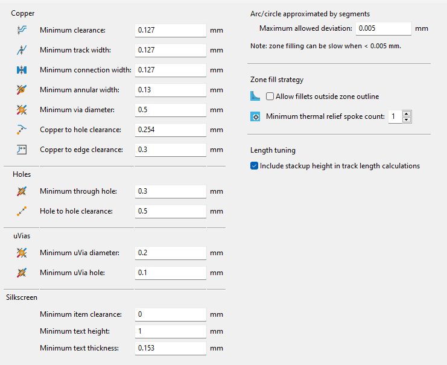

# Cornia PCB

The Cornia PCB is designed with 0.25mm track width (0.5mm for VCC, VBUS & GND) and 0.25mm of track clearance.
It is fully compliante with the [JLCPCB capabilities](https://jlcpcb.com/capabilities/pcb-capabilities) except for distance between holes of the hotswap socket :




## Fabrication files export

> **&#9432;**  Kicad 8 or later is mandatory to use the export in CLI 

To ease the fabrication files export from Kicad this process is automated using [export_fab_output.sh](../export_fab_output.sh) bash script.

This script perform 3 actions:
- Check PCB DRC (DRC report is saved [here](../PCB/cornia-drc.report))
- Export .dxf files for laser cutted case
- Export gerber, drill & map files for PCB manufacturing

To run this script on Windows it is necessary to have [git-bash](https://www.git-scm.com/download/win).

On Linux this script need to be updated to call the kicad-cli binary instead of the .exe expected on Windows.

It may be necessary to add execution right to the script by running `chmod +x export_fab_output.sh`

### Export DXF for laser cutted case

PCB layers `User.8` & `User.9` are respectively used in cornia footprint & pcb to export DXF for a laser cutted case using [Kicad-CLI](https://docs.kicad.org/8.0/en/cli/cli.html).

``` bash
kicad-cli pcb export dxf -o case/LaserCut.TOP.dxf -l User.8 --ou mm cornia.kicad_pcb
kicad-cli pcb export dxf -o case/LaserCut.BOT.dxf -l User.9 --ou mm cornia.kicad_pcb
```

### Export Gerber for JLCPCB

Based on JLCPCB [kicad export](https://jlcpcb.com/help/article/362-how-to-generate-gerber-and-drill-files-in-kicad-8) recommendations & [Kicad-CLI](https://docs.kicad.org/8.0/en/cli/cli.html) the following commands allow to export all gerber files (including Drill/Map files).

``` bash
kicad-cli pcb export gerbers -o gerber/ -l F.Cu,B.Cu,F.Paste,B.Paste,F.Silkscreen,B.Silkscreen,F.Mask,B.Mask,Edge.Cuts --exclude-value --no-x2 --no-netlist --subtract-soldermask cornia.kicad_pcb
kicad-cli pcb export drill -o gerber/ --format excellon --excellon-separate-th --generate-map --map-format gerberx2 cornia.kicad_pcb
```
