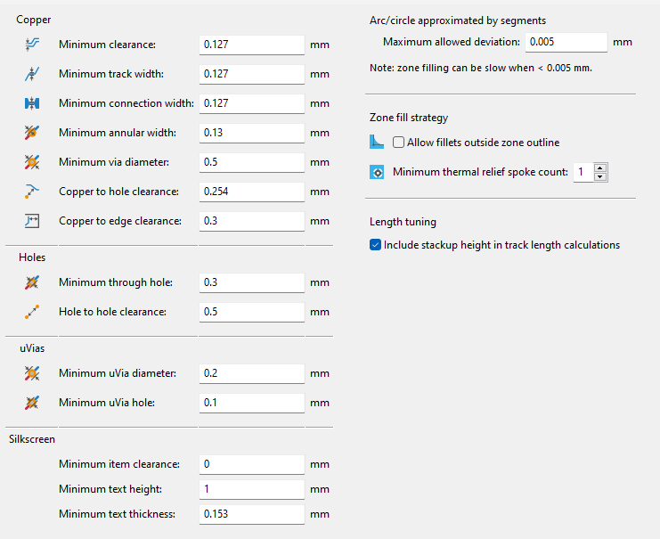
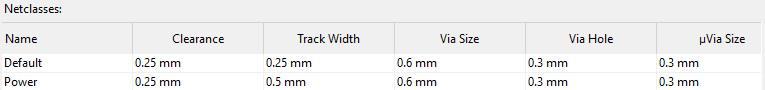
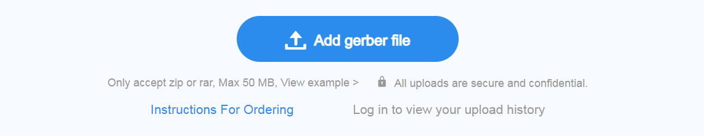
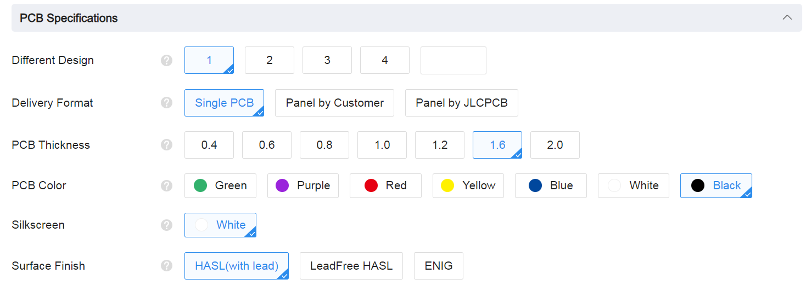
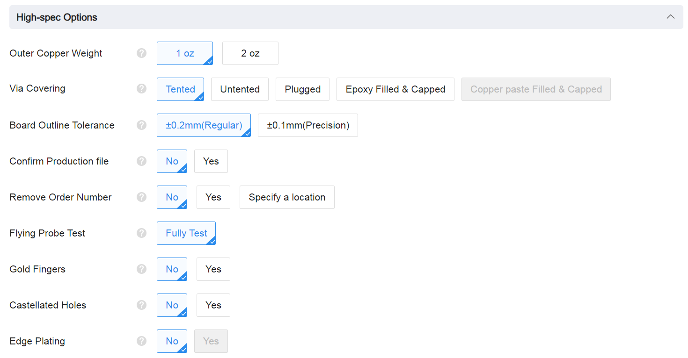

# Cornia PCB

The Cornia PCB is designed with 0.25mm track width (0.5mm for VCC, VBUS & GND) and 0.25mm of track clearance.

Below are the constraints of the Design Rules Check (DRC) used in Kicad :

<h3 align="center"></h3>
<h3 align="center"></h3>

It is fully compliant with the [JLCPCB capabilities](https://jlcpcb.com/capabilities/pcb-capabilities) except for distance between holes of the hotswap socket.

Test was done with JLCPCB manufacturing but the Cornia can be printed with the PCB manufacturer of your choice, just be carefull about their capabilities and compare with the one in the pictures above.

## PCB Order

> **&#9432;**  This guide is based on JLCPCB website at the date it is written, if the interface changed drastically you could open an issue.

> **&#9432;**  For other PCB manufacturer, instructions can be adapted as the process is barely the same.

0. If PCB was modified, please check [Manufacturing files export guide](./manufacturing_files_export.md) 
1. Create a `.zip` with the content of the [gerber/](../gerber/) folder, no matter the name of the zip but `cornia_Vx.x.zip` with `Vx.x` the version used can help to keep track of your work.  
2. Go to [jlcpcb.com](https://jlcpcb.com/) and register then login, or just login if you already have an account.
3. Click on [Instant Quote](https://cart.jlcpcb.com/quote).
    <h3 align="center"></h3>

4. Upload the gerber `.zip` by clicking `Add gerber file` button or drag and drop the `.zip` on the this button. The upload can take a moment before showing the PCB preview.
    <h3 align="center"></h3>

5. Ensure that the following `PCB Specification` is checked (except for the color, choose the color you want !)
    - Different Design : 1 (only one design in the .zip)
    - Delivery format : Single PCB
    - PCB Thickness : 1.6mm (standard)
    - Surface Finish : HASL with lead (Hot-Air Solder Leveling), other solution are ok but it's the cheapest. 
    <h3 align="center"></h3>

6. Ensure that the following `High-spec Options` is checked.
    - Outer Copper Weight : 1oz (standard)
    - Via Covering : Tented
    - Board Outline Tolerance : ±0.2mm (No need for more)
    - Confirm Production file : No (Except if you made some modifications to the design)
    - Remove Order Number : No (or Yes if the price do not matter)
    - Flying Probe Test : Fully Test
    - Gold Fingers : No
    - Castellated Holes : No
    - Edge Plating : No
    <h3 align="center"></h3>

7. Do not modify the `Advanced Options` tab except you know what you're doing.
8. Choose your shipping method and proceed to checkout.
9. Order other elements from the BOM. 
10. Take a look at the software documentation before the delivery ! &#128513;
