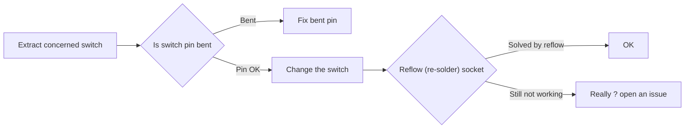
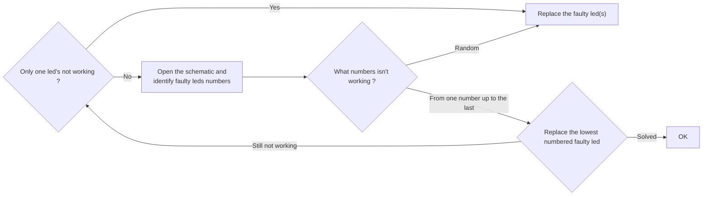

# PCB troubleshooting guide

## Prerequisites

- Multimeter with continuity tester
- [PCB Schematic](../pdf/SCH.pdf)
- Patience !

## A key is not working

If one or more keys are not working:

## Multiple keys are registered when a single one is pressed

If two or more keys are registered when a single one is pressed it can be one of the followings:

- Cheap grab bag kecaps. The keycaps have some plastic injection points that protrude under the next keycap. When pressing the key, the small plastic tab is long/big enough to get caught under and force the second key to go down as well. Remove the keycap and cut the protruding plastic tab and re-install.
- A short between two controller pins. Check the soldering on the controller pins and verify that adjacent pins don't have continuity. If this is the case, remove solder from these pins and re-check for a short.

## A led is not working

If one or more leds are not working:

